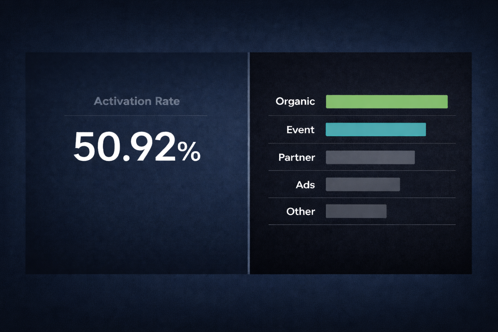
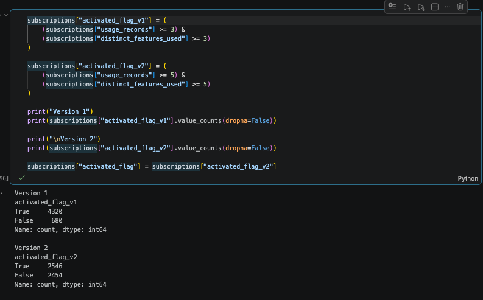
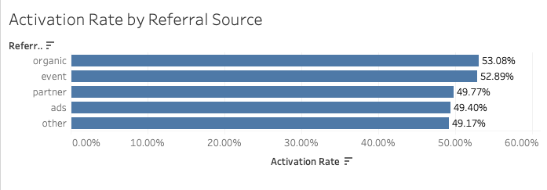
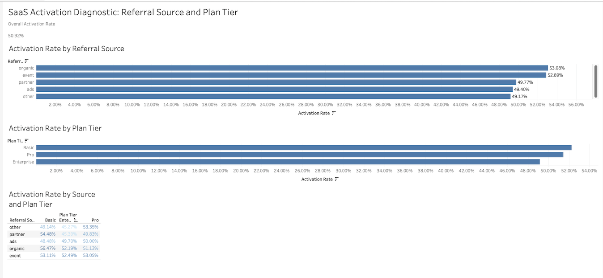

# When SaaS Activation Looks Stable Until You Segment It

A subscription-level diagnostic of how activation quality shifted across source and plan segments.

## Overview

This project examines how SaaS activation performance can look acceptable at the aggregate level while still hiding meaningful variation underneath. Using a multi-table SaaS subscription dataset from Kaggle, I built a subscription-level activation analysis in Python and a segmented Tableau dashboard to diagnose where activation quality was strongest, weakest, and most uneven.

At first glance, activation did not look like the main problem. The overall activation rate was **50.92%**, which made performance look relatively stable on the surface. But that average turned out to be doing too much hiding. Once the data was segmented, it became clear that activation quality was not evenly distributed across the subscription base.

## Business Problem

The real business risk was not low activation in general, but misreading where activation strength and weakness were actually concentrated. A stable headline rate can make performance look more consistent than it is, which makes it easier to miss the subscription segments where friction is quietly building.

In this case, the important question was whether activation quality changed depending on how subscriptions were acquired and which plan tier they entered. That is the difference between reporting activation and diagnosing it.

## Project Goal

The goal of the project was to pinpoint where activation friction was concentrated across subscriptions and determine whether acquisition source and plan tier were the clearest levers for understanding activation quality.

More specifically, the analysis was built to answer this question:

> **Which source and plan combinations created the strongest and weakest activation environments?**

## Dataset

I used a **multi-table SaaS subscription dataset from Kaggle** as a controlled environment for testing activation logic and segmentation.

The dataset included separate tables for:

- accounts
- subscriptions
- feature usage
- churn events
- support tickets

The core analysis focused on the account, subscription, and feature-usage tables. These provided the structure needed to evaluate how subscriptions were created, what plan tier they entered, how deeply they used the product, and whether activation quality changed across different segments.

The final analysis table used in Tableau was exported as:

- `data/processed/final_activation_table.csv`

## Analytical Thinking

The first instinct was to measure activation through time-to-first-usage logic, but that method did not hold up cleanly once the tables were joined. A large share of subscriptions showed first usage earlier than subscription start, which made a simple time-based activation definition unreliable. Instead of forcing a cleaner story than the data could support, I shifted the analysis toward usage depth and tested multiple behavioral thresholds.

That led to a stricter activation rule based on at least **five usage records** and **five distinct features used**. The more important analytical decision came after that: the project stayed at the **subscription level** because account-level rollups flattened too much of the variation that mattered. Once the data was segmented, the useful story was no longer the average activation rate, but the uneven activation environments created by source and plan tier together.

## Method

The analysis was built at the **subscription level**, not the account level, because account-level rollups flattened too much of the variation that mattered.

The workflow followed these steps:

1. Loaded and inspected the raw SaaS tables in Python
2. Validated the join keys across account, subscription, and usage data
3. Converted date fields and tested time-based activation logic
4. Rejected unreliable timing logic after finding inconsistent sequencing
5. Summarized usage depth at the subscription level
6. Compared multiple activation threshold definitions
7. Locked the final activation rule
8. Built the final subscription-level analysis table
9. Exported the final table to CSV for Tableau
10. Built segmented views to compare activation quality by source, plan, and their interaction

### Activation threshold comparison

## Key Findings

The overall activation rate came out to **50.92%**, but the segmented view made the variation underneath that average much easier to see.

### 1. Activation was uneven, not universally weak
The headline number looked stable enough on the surface, but segmentation showed that performance was not distributed evenly across the subscription base.

### 2. Referral source mattered more than trial status
Trial status added little separation, while referral source revealed a clearer activation-quality gap. **Organic** and **event-driven** subscriptions consistently outperformed **ads** and **other** sources.

### 3. Enterprise underperformed Basic and Pro
Plan tier changed the picture, but not in the expected direction. The highest-value tier did not produce the strongest activation environment. **Enterprise** underperformed both **Basic** and **Pro**.

### 4. The strongest signal came from the interaction between source and plan tier
The most useful insight was not source alone or tier alone, but the combination. Activation quality was shaped by the specific **source-tier environments** subscriptions entered through.

### Referral source view

## Dashboard Preview

The Tableau dashboard was built to make the segmented variation visible in one place:

- overall activation rate
- activation rate by referral source
- activation rate by plan tier
- activation rate by source and plan tier

## Tools Used

- **Python**
- **pandas**
- **Jupyter Notebook / VS Code**
- **Tableau**
- **Kaggle dataset**

## Key Outcome

The value of the project was not the headline activation rate itself, but what happened once that number was broken apart. A stable-looking KPI became a much more useful diagnostic once the subscriptions were segmented by source and plan tier. Python was used to test the method, reject unreliable timing logic, and build the final working table, while Tableau made the variation visible in a way the average could not.

The final takeaway was simple:

> **Activation did not need a louder KPI. It needed a better lens.**
